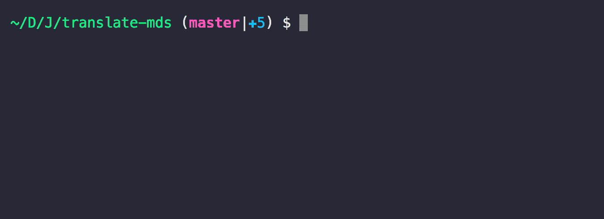

# translate .md to *.md [](https://github.com/chinanf-boy/explain-translateMds)

like

``` bash
.md to .「all-language」.md
```

[english](./README.en.md)

---


[](https://travis-ci.org/chinanf-boy/translate-mds)
[](https://codecov.io/gh/chinanf-boy/translate-mds)
[](https://github.com/chinanf-boy/translate-mds/blob/master/License)
[](https://nodei.co/npm/translate-mds/)

## 生活

[help me live , live need money 💰](https://github.com/chinanf-boy/live-need-money)

---

<!-- START doctoc generated TOC please keep comment here to allow auto update -->
<!-- DON'T EDIT THIS SECTION, INSTEAD RE-RUN doctoc TO UPDATE -->


- [这个项目是 为了 所有-的-markdown-编写-文件📃 翻译 的 `工具`](#%E8%BF%99%E4%B8%AA%E9%A1%B9%E7%9B%AE%E6%98%AF-%E4%B8%BA%E4%BA%86-%E6%89%80%E6%9C%89-%E7%9A%84-markdown-%E7%BC%96%E5%86%99-%E6%96%87%E4%BB%B6-%E7%BF%BB%E8%AF%91-%E7%9A%84-%E5%B7%A5%E5%85%B7)
- [Demo](#demo)
- [命令行选项](#%E5%91%BD%E4%BB%A4%E8%A1%8C%E9%80%89%E9%A1%B9)
- [项目引用](#%E9%A1%B9%E7%9B%AE%E5%BC%95%E7%94%A8)
  - [translate(options,debug)](#translateoptionsdebug)
  - [options 当用 `[]`](#options-%E5%BD%93%E7%94%A8-)
  - [options 当 用 `{}`](#options-%E5%BD%93-%E7%94%A8-)
- [My-translate-list](#my-translate-list)
- [常见问题](#%E5%B8%B8%E8%A7%81%E9%97%AE%E9%A2%98)
  - [1. 有时会抽风会卡住,停滞](#1-%E6%9C%89%E6%97%B6%E4%BC%9A%E6%8A%BD%E9%A3%8E%E4%BC%9A%E5%8D%A1%E4%BD%8F%E5%81%9C%E6%BB%9E)
  - [2. 没翻译成功的有 数量/总数](#2-%E6%B2%A1%E7%BF%BB%E8%AF%91%E6%88%90%E5%8A%9F%E7%9A%84%E6%9C%89-%E6%95%B0%E9%87%8F%E6%80%BB%E6%95%B0)
  - [欢迎👏 ISSUE 和 PULL](#%E6%AC%A2%E8%BF%8E-issue-%E5%92%8C-pull)
- [特性](#%E7%89%B9%E6%80%A7)

<!-- END doctoc generated TOC please keep comment here to allow auto update -->

## 这个项目是 为了 所有-的-markdown-编写-文件📃 翻译 的 `工具`

``` js
npm install -g translate-mds
```

``` js
// all folder·
translateMds md/

//or single file

translateMds test.md
```

## Demo



## 命令行选项

``` bash
  translate [folder/single] md file language to you want

  Usage
    $ translateMds [folder/file name] [options]

  Example
    $ translateMds md/

    [options]
    -a   API      : default < baidu >
    {google|baidu|youdao}
    -f   from     : default < en >
    -t   to       : default < zh >
    -N   num      : default < 1 > {async number}
    -R   rewrite  : default < false > {yes/no rewrite translate file}

  🌟[high user options]❤️

    -D   debug
    -G   google.com     : default < false > { cn => com with Google api }
    -F   force          : default < false > { If, translate result is no 100%, force wirte md file }
    -M   match          : default [ ". ", "! "//...] {match this str, merge translate result }
    -S   skips          : default ["... ", "etc. ", "i.e. "] {match this str will, skip merge translate result}
    -T   types          : default ["html", "code"] {pass the md AST type}
    --timewait          : default: 80 {each fetch api wait time}
    --values [path]     : default: false {the original output file to be translated} [single file])
    --translate [path]  : default: false {use this file translate} [single file]
```

## 项目引用

``` js
const translate = require('translate-mds')
//
let results = await translate([__dirname+'/feature/testWrite1.md'])
//or
let results = await translate([__dirname+'/md/'])
// results is Array
results = [{text:_translteText, error:String}]

```

### translate(options,debug)

### options 当用 `[]`

[ aFile,api,tF,tT ] = options

### options 当 用 `{}`

> optioins = {aFile: `String` ,api: `String` ,tF: `String` tT: `String` }

name | default | desc
---------|----------|---------
 aFile |  | absolute file
 api |  `google` | {'google','baidu','youdao'}
 tF |  `en` | from language
 tT |  `zh` | to language
 debug |  `info` | winston level

---

## My-translate-list

[项目测试翻译列表](https://github.com/chinanf-boy/translate-mds-test-list) or
[更多中文🇨🇳翻译列表](https://github.com/chinanf-boy/chinese-translate-list)

## 常见问题

### 1. 有时会抽风会卡住,停滞

``` js
If slow , may be you should try again or use -D
```

问题来自 API, 你只要再运行.

### 2. 没翻译成功的有 数量/总数

> 数量是 没有翻译成功/总数是 单个文件翻译总数

出现这样的问题, 一般是来自 不常见符号/或句子过长 导致的 字符移位.

这个时候, 你可以使用 `-D` 调试 / `-F` 强制写入文件 / 调整不常见的字符

[具体可看](https://github.com/chinanf-boy/translate-mds/issues/22)

## Tips

 - `--timewait [number]` 可以拉长每次请求翻译的时间, 减少被禁ip
 - `--values [file-path]` (单个文件使用) 获得将要翻译的原本输出文件
 - `--translate [file-path]` (单个文件使用) 取代请求api, 改为使用此文件的翻译内容

### 欢迎👏 ISSUE 和 PULL

## 特性

- [x] 提高http之类的md格式准确率
- [x] 自动换 翻译源
- [x] 启用 md AST

---

使用 [`remark`](https://github.com/wooorm/remark) 提高精准度

使用 [`translation.js`](https://github.com/Selection-Translator/translation.js) 完成 与翻译网站的交互

还有个 [异步Promise 递归的 例子](https://github.com/chinanf-boy/translate-mds/blob/master/src/setObjectKey.js#L78)
